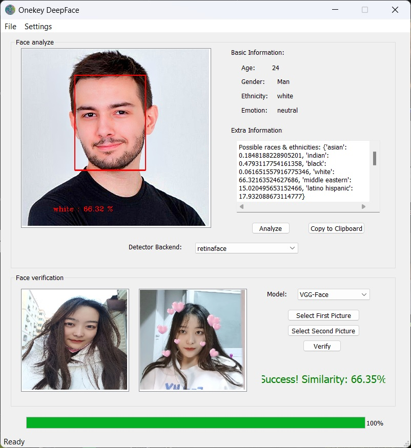

# DeepFace GUI Toolbox


*Read this in other languages: [English](README.md), [Spanish](README_es.md), [French](README_fr.md), [Brazilian Portuguese](README_pt-BR.md), [Arabic](README_ar.md), [Simplified Chinese](README_zh-CN.md).*

### 1. Introduction

> Deepface is a lightweight Python framework for face recognition and facial attribute analysis (age, gender, emotion and race). It is a hybrid face recognition framework wrapped with state-of-the-art models. VGG-Face, Google FaceNet, OpenFace, Facebook DeepFace, DeepID, ArcFace, Dlib and SFace.

However, the original project only had an API module and sample console program, which were not convenient to use and operate; also, since the corresponding model files needed to be downloaded from the Internet to recognize facial features, and these files are very large and their URLs in some countries (China, Iran, Venezuela ......) are interfered and blocked, I developed a program with a visual interface using Python+PyQt5. It supports the following features: 

- Represent recognized facial areas by rectangular checkboxes; 
- Do thoroughly age, gender, race, emotion analysis, where race and expression analysis can be accurate down to the percentage of each possible recognition result;
- Verify whether two faces represent the same person, i.e. inferring similarity with percentange;
- Multiple choices of face detector backends and verification models;
- Proxy configuration to speed up model files downloading (currently only support HTTP(S) protocol, SOCKS protocol proxy still needs to be studied and improved);
- Friendly user interface.

### 2. Usage

1. Download and install Anaconda and then deploy an virtual Python 3.9 environment inside it;

2. Install packages by following commands:

   ```bash
   pip install deepface configparser urllib3 PyQt5 PyQt5-tools
   ```

3. Run main.py

Now the single file runtime environment is also being packaged and will be released to Releases later.

If you want to redesign the UI files, you should regenerate corresponding initialization code files after your edition by following commands:

```bash
pyuic5 -o ventana.py ventana.ui
```

### 3. Example facial picture assets

I put the face pictures of corresponding races in five folders: *asian, black, hispanic, india_arab, white*, each folder has about 15 pictures. You can freely use them for analysis and testing.

### 4. Screenshot


