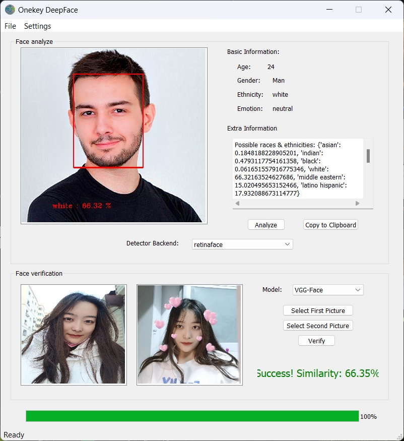

# DeepFace GUI Toolbox


*Leia-o em outros idiomas: [Inglês](README.md), [Espanhol](README_es.md), [Francês](README_fr.md), [Português Brasileiro](README_pt-BR.md), [Árabe](README_ar.md), [Chinês Simplificado](README_zh-CN.md).*

### 1. Introdução

> Deepface é uma framework leve em Python para reconhecimento facial e análise dos atributos faciais (idade, sexo, emoção e raça). É uma estrutura híbrida de reconhecimento facial envolvida com modelos de última geração. VGG-Face, Google FaceNet, OpenFace, Facebook DeepFace, DeepID, ArcFace, Dlib e SFace.

Entretanto, o projeto original tinha apenas um módulo API e um programa de console de exemplo, que não eram convenientes de usar e operar; além disso, como os arquivos de modelo correspondentes tinham que ser baixados da Internet para reconhecer características faciais, e estes arquivos são muito grandes e suas URLs em alguns países (China, Irã, Venezuela, ...) estão bloqueadas e bloqueadas, desenvolvi um programa com uma interface visual usando Python+PyQt5. Ele suporta as seguintes características: 

- Representar as áreas faciais reconhecidas por meio de caixas retangulares; 
- Realizar uma análise abrangente da idade, gênero, raça e emoções, onde a análise da raça e expressão pode ser precisa até a porcentagem de cada resultado possível de reconhecimento;
- Verificar se duas faces representam a mesma pessoa, ou seja, inferir similaridade com porcentagem;
- Múltiplas opções para backends de detectores de face e modelos de verificação;
- Configuração de proxy para acelerar o download de arquivos de modelos (atualmente só o protocolo HTTP(S) é suportado, o proxy do protocolo SOCKS ainda precisa ser estudado e melhorado);
- Interface amigável para o usuário.

### 2. Utilização

1. Baixar e instalar o Python 3.9;

2. Instalar os pacotes usando os seguintes comandos:

   ```bash
   pip install deepface dlib configparser urllib3 PyQt5 PyQt5-tools
   ```

3. Executar main.py

O ambiente de execução de arquivo único agora também está sendo embalado e será lançado em versões posteriores.

Se você deseja redesenhar os arquivos de interface do usuário, você deve regenerar os arquivos de código de inicialização correspondentes após editá-los usando os seguintes comandos:

```bash
pyuic5 -o ventana.py ventana.ui
```

### 3. Exemplo de recursos de imagem facial

Coloco as fotos dos rostos das raças correspondentes em cinco pastas: *asian, black, hispanic, india_arab, white*, onde cada pasta tem cerca de 15 fotos. Vocês são livres para usá-los livremente para análises e testes.

### 4. Tela de interface deste software


